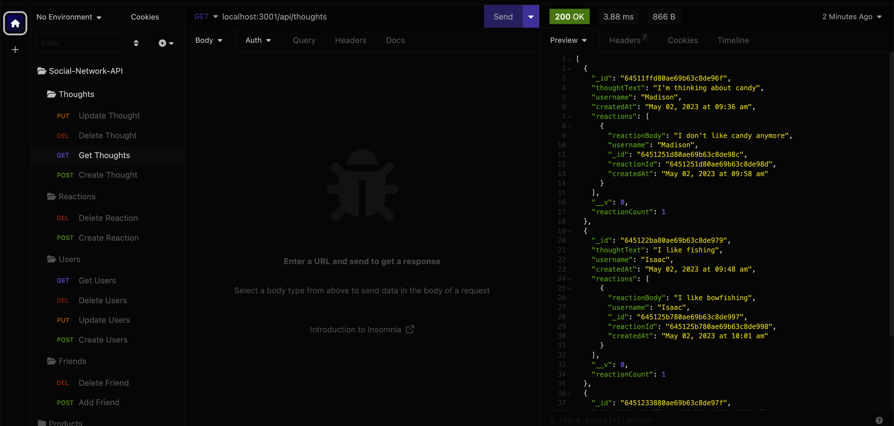
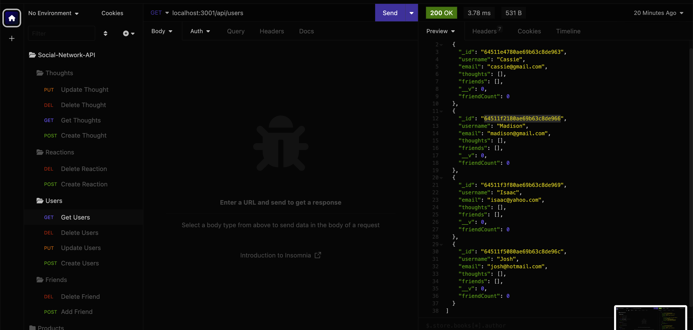

# Social-Network-API

## Table of Contents
* [Descriptions](#description)
* [Installation](#installation)
* [Dependencies](#dependencies)
* [Usage](#usage)
* [Credits](#credits)
* [License](#license)
* [Questions](#questions)

## Description

This API provides functionality for a social network web application that allows users to share their thoughts, react to their friends' posts, and create a list of friends. It leverages Express.js for routing, a MongoDB database with Mongoose ODM, and Moment.js for timestamp formatting. Insomnia is used to generate seed data.

## Installation

npm i

## Dependencies

1. Express 
2. Mongoose

## Usage

[Walkthrough]()

## Credits

[Sara Schroeder](https://github.com/saraschroeder)

## License

[MIT](https://choosealicense.com/licenses/mit/)

## Questions

If you have any questions, please contact me at [sara.schroeder00@gmail.com](mailto:sara.schroeder00@gmail.com). 

Please find my GitHub here!
[saraschroeder](https://github/saraschroeder)